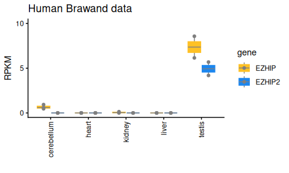

EZHIP_RNAseq_Example_Script_human
================

This code is an example script. Here we process just the human Brawand
tissue data - we used very similar code for the other datasets.

Input = results of running bedtools multicov (RNA-seq read counts per
gene)

Tasks:

- transform those counts to RPKMs
- generate a plot of expression levels of each gene in each tissue

Defining location of files of interest

``` r
malik_h_dir <- "/fh/fast/malik_h/"

top_level_dir <- paste0(malik_h_dir, 
                        "grp/public_databases/NCBI/SRA/data/mammalian_expression_profiles/")

flagstats_dir <- paste0(top_level_dir, 
                        "human/human_Brawand/STAR_hg38_maxMultiHits1_renamed/")

dir.exists(flagstats_dir)
```

    ## [1] TRUE

Obtaining filenames of flagstats files:

``` r
flagstats_files <- list.files(flagstats_dir,
                              pattern="flagstats")
```

Define a function to read in flagstat files:

``` r
readFlagstatsFile <- function (myFile, 
                               myDir=NULL) {
    if(!is.null(myDir)) {
        myFileFullPath <- paste(myDir, myFile, sep="/")
    } else {
        myFileFullPath <- myFile
        myDir <- getwd()
    }
    if(!file.exists(myFileFullPath)) {
        stop("ERROR! the file you specified does not exist. Maybe use the myDir option?")
    }
    
    dat <- scan(myFileFullPath, sep="\n", what="character", quiet=TRUE)
    
    dat <- strsplit(dat, " ")
    
    numReads <- as.numeric(sapply(dat,"[[",1))
    
    readCategory <- sapply( dat, function(x) {
        y <- x[4:length(x)]
        y <- paste(y, collapse=" ")
        return(y)
    })
    
    dat <- tibble(numReads=numReads,
                  description=readCategory,
                  file=myFile,
                  dir=myDir) |>
        mutate(file=gsub("_STAR\\.bam\\.flagstats", "", file)) 
    return(dat)
}
```

Read all flagstats files:

``` r
brawand_flatstats_output <- lapply(flagstats_files, function(x) {
    flagstats_this_file <- readFlagstatsFile(x,  myDir=flagstats_dir) |> 
        
        filter(str_detect(description, "^mapped"))
}) |> 
    bind_rows()  |>
    select(-description)

brawand_flatstats_output |> 
    head(3)
```

    ## # A tibble: 3 × 3
    ##   numReads file                                dir                              
    ##      <dbl> <chr>                               <chr>                            
    ## 1 21452905 human_Brain_frontal_cortex1         /fh/fast/malik_h/grp/public_data…
    ## 2 14736907 human_Brain_frontal_cortex2         /fh/fast/malik_h/grp/public_data…
    ## 3 19505630 human_Brain_prefrontal_cortex_Male1 /fh/fast/malik_h/grp/public_data…

Read bedtools multicov counts file:

``` r
counts_dir <- paste0(malik_h_dir,
                     "grp/malik_lab/Former_Lab_Members/PravruthaRaman/EZHIP_RNAseq/Counts/")


brawand_counts_file <- paste0(
    counts_dir,
    "Human_AncDup_hg38.bed.counts.human_Brawand.split.multicov")

brawand_counts <- brawand_counts_file |> 
    read_tsv(show_col_types = FALSE)

brawand_counts
```

    ## # A tibble: 2 × 25
    ##   chr      start      end name     human_Brain_frontal_…¹ human_Brain_frontal_…²
    ##   <chr>    <dbl>    <dbl> <chr>                     <dbl>                  <dbl>
    ## 1 chr5  12794328 12794592 Hum_EZH…                      0                      0
    ## 2 chrX  51407016 51408528 Hum_EZH…                      0                      4
    ## # ℹ abbreviated names: ¹​human_Brain_frontal_cortex1,
    ## #   ²​human_Brain_frontal_cortex2
    ## # ℹ 19 more variables: human_Brain_prefrontal_cortex_Male1 <dbl>,
    ## #   human_Brain_prefrontal_cortex_Male2 <dbl>,
    ## #   human_Brain_prefrontal_cortex <dbl>, human_Brain_temporal_lobe_Male <dbl>,
    ## #   human_Cerebellum_Female <dbl>, human_Cerebellum_Male1 <dbl>,
    ## #   human_Cerebellum_Male2 <dbl>, human_Heart_Female <dbl>, …

Pivot longer, show first few rows

``` r
brawand_counts_long <- brawand_counts |> 
    mutate(gene_width=end-start) |> 
    select(-c(chr, start, end)) |> 
    pivot_longer(cols = -c(name,gene_width),
                 names_to="RNAseq_sample",
                 values_to="count")
brawand_counts_long 
```

    ## # A tibble: 42 × 4
    ##    name          gene_width RNAseq_sample                       count
    ##    <chr>              <dbl> <chr>                               <dbl>
    ##  1 Hum_EZHIP_Dup        264 human_Brain_frontal_cortex1             0
    ##  2 Hum_EZHIP_Dup        264 human_Brain_frontal_cortex2             0
    ##  3 Hum_EZHIP_Dup        264 human_Brain_prefrontal_cortex_Male1     0
    ##  4 Hum_EZHIP_Dup        264 human_Brain_prefrontal_cortex_Male2     0
    ##  5 Hum_EZHIP_Dup        264 human_Brain_prefrontal_cortex           0
    ##  6 Hum_EZHIP_Dup        264 human_Brain_temporal_lobe_Male          0
    ##  7 Hum_EZHIP_Dup        264 human_Cerebellum_Female                 0
    ##  8 Hum_EZHIP_Dup        264 human_Cerebellum_Male1                  0
    ##  9 Hum_EZHIP_Dup        264 human_Cerebellum_Male2                  0
    ## 10 Hum_EZHIP_Dup        264 human_Heart_Female                      0
    ## # ℹ 32 more rows

Add total number of reads sequenced for each sample (from flagstats
files)

``` r
brawand_counts_long <- left_join(brawand_counts_long, 
                                 brawand_flatstats_output |> 
                                     select(file, totReads=numReads), 
                                 by=c("RNAseq_sample"="file"))
brawand_counts_long |> 
    head(3)
```

    ## # A tibble: 3 × 5
    ##   name          gene_width RNAseq_sample                       count totReads
    ##   <chr>              <dbl> <chr>                               <dbl>    <dbl>
    ## 1 Hum_EZHIP_Dup        264 human_Brain_frontal_cortex1             0 21452905
    ## 2 Hum_EZHIP_Dup        264 human_Brain_frontal_cortex2             0 14736907
    ## 3 Hum_EZHIP_Dup        264 human_Brain_prefrontal_cortex_Male1     0 19505630

Calculate reads per million sequenced, per kb of gene_width

``` r
brawand_counts_long <- brawand_counts_long |> 
    mutate(rpkm = (count  /  (totReads/10^6) ) / (gene_width/10^3) )

brawand_counts_long |> 
    select(name, RNAseq_sample, count, rpkm)
```

    ## # A tibble: 42 × 4
    ##    name          RNAseq_sample                       count  rpkm
    ##    <chr>         <chr>                               <dbl> <dbl>
    ##  1 Hum_EZHIP_Dup human_Brain_frontal_cortex1             0     0
    ##  2 Hum_EZHIP_Dup human_Brain_frontal_cortex2             0     0
    ##  3 Hum_EZHIP_Dup human_Brain_prefrontal_cortex_Male1     0     0
    ##  4 Hum_EZHIP_Dup human_Brain_prefrontal_cortex_Male2     0     0
    ##  5 Hum_EZHIP_Dup human_Brain_prefrontal_cortex           0     0
    ##  6 Hum_EZHIP_Dup human_Brain_temporal_lobe_Male          0     0
    ##  7 Hum_EZHIP_Dup human_Cerebellum_Female                 0     0
    ##  8 Hum_EZHIP_Dup human_Cerebellum_Male1                  0     0
    ##  9 Hum_EZHIP_Dup human_Cerebellum_Male2                  0     0
    ## 10 Hum_EZHIP_Dup human_Heart_Female                      0     0
    ## # ℹ 32 more rows

Get sample name without replicate ID and sex, so we can plot those
together

``` r
brawand_counts_long <- brawand_counts_long |> 
    mutate(RNAseq_sample_noRep = gsub("\\d","",RNAseq_sample )) |> 
    mutate(RNAseq_sample_noRep = gsub("_Male","",RNAseq_sample_noRep )) |> 
    mutate(RNAseq_sample_noRep = gsub("_Female","",RNAseq_sample_noRep )) |> 
    relocate(RNAseq_sample_noRep, .after=RNAseq_sample)
brawand_counts_long
```

    ## # A tibble: 42 × 7
    ##    name        gene_width RNAseq_sample RNAseq_sample_noRep count totReads  rpkm
    ##    <chr>            <dbl> <chr>         <chr>               <dbl>    <dbl> <dbl>
    ##  1 Hum_EZHIP_…        264 human_Brain_… human_Brain_fronta…     0 21452905     0
    ##  2 Hum_EZHIP_…        264 human_Brain_… human_Brain_fronta…     0 14736907     0
    ##  3 Hum_EZHIP_…        264 human_Brain_… human_Brain_prefro…     0 19505630     0
    ##  4 Hum_EZHIP_…        264 human_Brain_… human_Brain_prefro…     0 21535616     0
    ##  5 Hum_EZHIP_…        264 human_Brain_… human_Brain_prefro…     0 31034194     0
    ##  6 Hum_EZHIP_…        264 human_Brain_… human_Brain_tempor…     0  4575735     0
    ##  7 Hum_EZHIP_…        264 human_Cerebe… human_Cerebellum        0 27702461     0
    ##  8 Hum_EZHIP_…        264 human_Cerebe… human_Cerebellum        0 18821622     0
    ##  9 Hum_EZHIP_…        264 human_Cerebe… human_Cerebellum        0 18494729     0
    ## 10 Hum_EZHIP_…        264 human_Heart_… human_Heart             0 19595796     0
    ## # ℹ 32 more rows

Now plot, as in Fig 4B

``` r
EZHIP_color_scheme <- character()
EZHIP_color_scheme["EZHIP"] <- "goldenrod1"
EZHIP_color_scheme["EZHIP2"] <- "dodgerblue2"

p1 <- brawand_counts_long |> 
    ## tidy up the data a little more
    filter(!str_detect(RNAseq_sample_noRep, "human_Brain")) |> 
    select(tissue=RNAseq_sample_noRep, gene=name, rpkm) |> 
    mutate(tissue = tolower(str_remove_all(tissue, "human_"))) |> 
    mutate(gene = str_remove_all(gene, "Hum_")) |> 
    mutate(gene = str_replace_all(gene, "_Dup", "2")) |> 
    mutate(gene = str_remove_all(gene, "_Anc")) |> 
    ## plot
    ggplot(aes(x=tissue, y=rpkm,
               fill=gene, color=gene )) +
    geom_boxplot(whisker.linewidth=0.5, whisker.color="gray50",
                 median.linewidth = 0.5, median.colour="gray50") +
    geom_point(size=1.5, color ="gray50", position=position_dodge(width=0.75)) +
    labs(x="", y= "RPKM", title= "Human Brawand data") +
    theme_classic() +
    scale_fill_manual(values=EZHIP_color_scheme) +
    scale_color_manual(values=EZHIP_color_scheme) +
    expand_limits(y=10) +
    scale_y_continuous(breaks=c(0,5,10)) +
    theme(axis.text.x = element_text(angle = 90, hjust = 1, vjust = 0.5))
p1
```

<!-- -->

# Show R and package versions used

``` r
sessionInfo()
```

    ## R version 4.5.2 (2025-10-31)
    ## Platform: x86_64-pc-linux-gnu
    ## Running under: Ubuntu 24.04.3 LTS
    ## 
    ## Matrix products: default
    ## BLAS:   /usr/lib/x86_64-linux-gnu/openblas-pthread/libblas.so.3 
    ## LAPACK: /usr/lib/x86_64-linux-gnu/openblas-pthread/libopenblasp-r0.3.26.so;  LAPACK version 3.12.0
    ## 
    ## locale:
    ##  [1] LC_CTYPE=en_US.UTF-8       LC_NUMERIC=C              
    ##  [3] LC_TIME=en_US.UTF-8        LC_COLLATE=en_US.UTF-8    
    ##  [5] LC_MONETARY=en_US.UTF-8    LC_MESSAGES=en_US.UTF-8   
    ##  [7] LC_PAPER=en_US.UTF-8       LC_NAME=C                 
    ##  [9] LC_ADDRESS=C               LC_TELEPHONE=C            
    ## [11] LC_MEASUREMENT=en_US.UTF-8 LC_IDENTIFICATION=C       
    ## 
    ## time zone: Etc/UTC
    ## tzcode source: system (glibc)
    ## 
    ## attached base packages:
    ## [1] stats     graphics  grDevices datasets  utils     methods   base     
    ## 
    ## other attached packages:
    ##  [1] here_1.0.2      lubridate_1.9.5 forcats_1.0.1   stringr_1.6.0  
    ##  [5] dplyr_1.2.1     purrr_1.2.2     readr_2.2.0     tidyr_1.3.2    
    ##  [9] tibble_3.3.1    ggplot2_4.0.3   tidyverse_2.0.0
    ## 
    ## loaded via a namespace (and not attached):
    ##  [1] bit_4.6.0           gtable_0.3.6        crayon_1.5.3       
    ##  [4] compiler_4.5.2      BiocManager_1.30.27 renv_1.2.3         
    ##  [7] tidyselect_1.2.1    parallel_4.5.2      scales_1.4.0       
    ## [10] yaml_2.3.12         fastmap_1.2.0       R6_2.6.1           
    ## [13] generics_0.1.4      knitr_1.51          rprojroot_2.1.1    
    ## [16] pillar_1.11.1       RColorBrewer_1.1-3  tzdb_0.5.0         
    ## [19] rlang_1.3.0         utf8_1.2.6          stringi_1.8.7      
    ## [22] xfun_0.60           S7_0.2.2            bit64_4.8.2        
    ## [25] otel_0.2.0          timechange_0.4.0    cli_3.6.6          
    ## [28] withr_3.0.3         magrittr_2.0.5      digest_0.6.39      
    ## [31] grid_4.5.2          vroom_1.7.1         rstudioapi_0.19.0  
    ## [34] hms_1.1.4           lifecycle_1.0.5     vctrs_0.7.3        
    ## [37] evaluate_1.0.5      glue_1.8.1          farver_2.1.2       
    ## [40] rmarkdown_2.31      tools_4.5.2         pkgconfig_2.0.3    
    ## [43] htmltools_0.5.9
